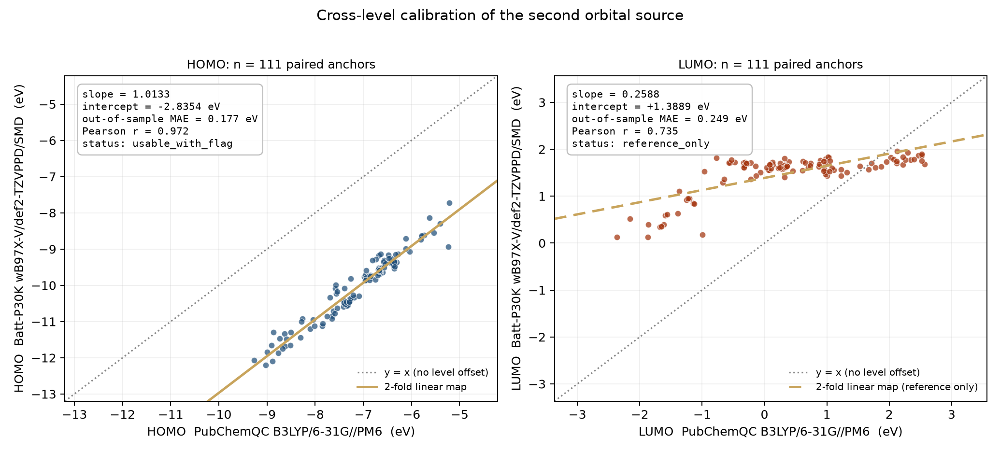
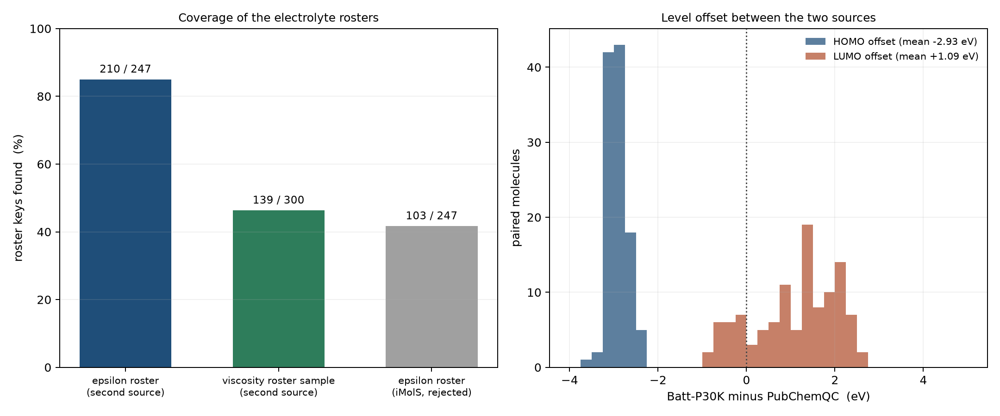
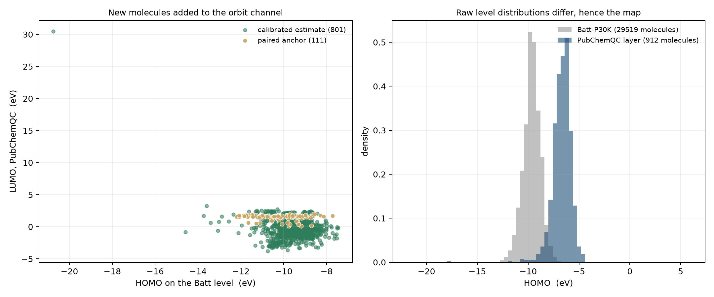

# W17-12 · 轨道第二源：PubChemQC B3LYP/6-31G\*//PM6 的定向取样、单位定案与跨水平标定

**一句话结论**：本臂为 Week 17 的轨道通道引入了一个**可再分发（CC BY 4.0）**的第二数据源。它在 ε 名册上命中 **210/247 = 85.0%**（此前 iMolS 只有 41.7%），并给出 **111 个与 Batt-P30K 配对**的分子；HOMO 的跨水平映射是一个近乎刚性的平移（slope 1.0133、截距 −2.8354 eV、样本外 MAE **0.177 eV**、r **0.972**，判定 `usable_with_flag`），LUMO 因 r 0.735 < 0.80 被判定 E 诚实降级为 `reference_only`。**Batt-P30K 仍是轨道通道唯一主源**，第二源只以增量列形式存在。

- 预注册：`probes/orbital_second_source_prereg.json`（`locked_before_run`，sha256 `162361c973c97d5be8b9ce68b4f5b7761813a2c6b09202e11d53dafe245326ed`）
- 生成器：`probes/build_orbital_second_source.py`（`--check` 逐字节重算）
- 校验器：`scripts/verify_orbital_second_source.py --check`（**24/24 PASS**；`--check-raw` 从原始层逐字节重算 **26/26 PASS**）
- 图层：`data/processed/orbital_second_source_layer.csv`（**912 行 / 35 列**，sha256 `ba55897a296181267cc0673cbf2d4d98d17b3e5de8280958b7896556e053abfe`）
- 摘要：`probes/orbital_second_source_summary.json`

## 1. 为什么是 PubChemQC（以及为什么不是 iMolS / Reaxys）

| 候选 | 含 HOMO/LUMO | 结构标识 | 许可 | 实测覆盖 | 裁决 |
| --- | --- | --- | --- | --- | --- |
| **PubChemQC B3LYP/6-31G\*//PM6**（MolSSI-AI Hub 镜像） | 是（α/β 双通道 + 全轨道数组） | `pubchem-inchi` / SMILES / CID | **CC BY 4.0** | ε 名册 **210/247** | **采纳**（第二源） |
| iMolS（shiyanjia） | 是（M06-2X/ma-def2-TZVP 单点） | 仅 SMILES，**无 InChIKey** | `robots.txt` 全站 Disallow，**无任何再分发条款**；原始文件下载需登录 | ε 名册 103/247（41.7%）；本仓轨道集 245/29,519（**0.83%**） | **否决**，只作离线参考 |
| Reaxys | 实测 0 条数值 | 有 | 商业库 | — | 只能当文献指路器 |
| QM9（DeepChem S3） | 是（`homo`/`lumo`/`gap`） | SMILES | 未核实 | 未采纳进层 | 备选锚点 |

Batt-P30K（`data/raw/batt/Batt-P30K.h5`，**wB97X-V/def2-TZVPPD/SMD(ε=18.5)**，DOI `10.1021/acsnano.6c06255`）仍是主源。两台机器的**计算水平不同**，这正是本臂要量化并冻结的东西。

## 2. 方法：有界、可复现、可核验

分片 `data/b3lyp_pm6/train/000000001-000253696.json` 是一个 **4,348,924,286 字节**的顶层 JSON 数组，记录按 `cid` 升序、每条 13–50 kB。整文件下载不在范围内，因此：

- **分片定位**：`cid` 是每条记录的**首个字段**，且分片内 `cid` 单调 ⇒ 用「插值搜索 + 有界 HTTP Range」把任意目标 CID 定位到字节窗口，再就地解析。全库 5 点结构探针给出 `cid` 窗口 `[1, 253696]`（0.00→cid 1，0.25→63,246，0.50→128,319，0.75→195,354，0.9999→253,670+）。
- **定向取样**：706 个目标 InChIKey（ε 名册全部 247 + η 名册随机 300 + 关键名册轨道池随机 200，seed `20260927`）经 PubChem PUG-REST listkey POST 解析为 CID（**619/706 解析成功**），配对候选 CID 全部 ≤ 分片上限；另加 23 个常见电解液溶剂按名称取 CID、以及分片头部 12 MB 的广度扫描。
- **痕迹**：`http_requests = 1246`、`http_bytes_read = 352,262,591`、`elapsed_seconds = 660.8`，全部写进 `data/raw/pubchemqc_w17/manifest.json`。
- **结构身份**：命中判定不看名字，只看 `pubchem-inchi` 经 RDKit 转出的 InChIKey 是否**逐字等于**目标键（判定 H）。结果：**结构错配 0 条**，1 条记录 InChI 不可解析（S 价态超限）。
- **原始层纪律**：所有原始字节只落在 `data/raw/pubchemqc_w17/`（被 `.gitignore` 忽略），交付层由生成器单独产出。

### 2.1 单位定案：数据集卡片的 `hartree` 标注是**文档缺陷**

卡片把 `orbital-energies` 标注为 hartree。原始数组证明它实际是 **eV**：

1. `orbital-energies[0][homos[0]]` 与标量字段 `energy-alpha-homo` **数值完全相等**（**240/240** 条记录，相对误差 ≤ 1e-9）；
2. `gap == lumo − homo` 对 **240/240** 条记录成立；
3. 数量级：cid 1 的 HOMO 若真是 −4.6096 hartree 即 −125 eV，对中性闭壳有机分子的**价层** HOMO 物理上不可能；
4. **独立物理锚点**：η 名册里合法地含有**氦**（ThermoML 气相黏度），其记录为 HOMO **−17.681958 eV**、LUMO **+30.471309 eV**、gap **48.153267 eV**——闭壳惰性气体没有低 lying 空轨道，这个量级只有 eV 讲得通。

因此单位判据整体定为 **eV**。`unit_check` 列是**分级**的：`verified_eV_audited` 表示**该行自己的 CID** 真的出现在分层单位审计里（**20 行**）；`dataset_level_eV` 表示单位由分层审计在**数据集层面**确立、但没有对该行逐条复核（**892 行**）。审计本身从最初 40 条扩到 **240 条**，跨 **12 层**、`cid_span_checked = [1, 233866]`，`240/240 passed`，并给出判别性证据 `valence_window_discriminates_units = true`（读成 hartree 时 HOMO 会落在 −0.17…−0.5 的窗口外）与 `card_declares_unit_for_scalar_fields = false`（卡片只误标了 `orbital-energies` 数组，**对标量字段从未声明单位**）。审计记录：`data/raw/pubchemqc_w17/unit_audit.json`。

## 3. 结果

### 3.1 覆盖（判定 C：ε ≥ 40、η 样本 ≥ 100 —— 均通过）

| 目标集 | 命中 | 命中率 |
| --- | --- | --- |
| ε 名册（`data/dielectric_v04.csv`） | **210 / 247** | **85.02%** |
| η 名册随机样本（300 键，seed 固定） | **139 / 300** | **46.33%** |
| 关键名册轨道池随机样本（200 键，seed 固定） | **12 / 200** | **6.0%** |
| 关键名册命中（`four_core_key_registry.csv`） | 348 / 31,949 | — |
| 与 Batt-P30K 配对（校准锚点） | **111** | — |

**三种口径不许混用**：η 全名册是 **1,228 键**，其中命中 **240**；上表第二行是**预注册 300 键随机样本**里的 **139** 命中。两者分母不同，不得相除、不得互换；summary 里三组数字各自带 `size` 与 `digest`，校验器 `sample_coverage_recomputed_from_the_sampler` 用采样器本身重算。

对比：iMolS 在 ε 名册上只有 103/247，在本仓轨道集上只有 245/29,519（0.83%）。**第二源的真实价值就在这里**：它把 ε 名册上「有介电常数但缺轨道量」的分子补上了 85%。

图层组成：`paired_anchor` **111**、`calibrated_estimate` **801**、`uncalibrated_reference` **0**。

### 3.2 跨水平能级偏移（Batt − PubChemQC，n = 111）

| 通道 | 均值 | 中位数 | 标准差 | 最小 | 最大 |
| --- | --- | --- | --- | --- | --- |
| HOMO | **−2.9297 eV** | −2.9414 | 0.2212 | −3.6997 | −2.4156 |
| LUMO | **+1.0941 eV** | +1.2860 | 0.9314 | −0.8815 | +2.6731 |

HOMO 偏移几乎是常量（σ 仅 0.22 eV），而 LUMO 偏移散布近 1 eV ——这直接解释了下面的标定结果。

### 3.3 跨水平标定（2 折、样本外，判定 D：n ≥ 60 —— 通过，n = 111）

| 通道 | slope | intercept | Pearson r | 样本外 MAE | 最大样本外误差 | 判定 E 结论 |
| --- | --- | --- | --- | --- | --- | --- |
| **HOMO** | **1.0132507837193052** | **−2.8354161402050426 eV** | **0.9717477841107552** | **0.17662467232470583 eV** | 0.8403 eV | **`usable_with_flag`** |
| LUMO | 0.2588045572302973 | +1.3888951334640842 eV | 0.7349044734023142 | 0.24935401611452185 eV | 1.1140 eV | `reference_only` |

判定 E 的两条门限是「样本外 MAE ≤ 0.35 eV **且** r ≥ 0.80」。LUMO 的 MAE 其实过关，但 **r = 0.735 < 0.80** 触发降级 ⇒ `calib_lumo_eV` 列**全空**，下游不得把 PubChemQC 的 LUMO 当作 Batt 级使用。这是本臂最重要的诚实边界。

HOMO 的映射 ≈ **刚性平移 −2.84 eV 加 ~1.3% 的斜率**，样本外 MAE 0.177 eV 已经与主记分牌上 HOMO 的门限（0.2 eV）同量级。

### 3.4 图

- `probes/artifacts/orbital_second_source_calibration.png` —— 配对散点 + 45° 线 + 2 折线性映射 + 样本外指标（HOMO / LUMO 对照）
- `probes/artifacts/orbital_second_source_coverage.png` —— 名册覆盖率（含 iMolS 对照）+ 能级偏移分布
- `probes/artifacts/orbital_second_source_landscape.png` —— 新增分子的 HOMO/LUMO 景观 + 两源原始 HOMO 分布（说明为什么必须做映射）





## 4. 诚实边界（必须随数字一起引用）

- **能级不可直接混用**：绝对轨道能级是水平依赖的。只有 `calibrated_estimate` 角色、且 `calibration_id = linear_2fold_v1` 的 `calib_homo_eV` 才允许与 Batt 值并列；`homo_eV`/`lumo_eV` 列是**原始 PubChemQC 值**，只能作描述与相对趋势。
- **LUMO 无合格映射**（见 3.3），所以本臂**不为 LUMO 提供可用的 Batt 级估计**。
- **分片 0 只覆盖 PubChem CIDs ≤ 253,696**：更高 CID 的电解质（例如 EMC = CID 522,046）本臂取不到，295 条 miss 里包含这一类。要扩展必须换分片。
- **取样不是普查**：η 名册是 300 键的随机样本（命中 139）、关键名册轨道池是 200 键的随机样本（命中 12，因多数 Batt 分子解析不到 PubChem CID），ε 名册是全覆盖。
- **配对集不是 Batt 池的随机样本**：111 个配对锚点里只有 **12** 个来自预注册 200 键随机抽样，**101** 个是恰好落在 Batt 池里的定向 ε/η 名册分子，**10** 个来自低 CID 头部扫描（CID 中位数 **8,452**、最大 **206,000**）。这张映射**代表电解质类分子**（正是预期用途），但**不得**引作「Batt 池 vs PubChemQC」的总体能级映射。
- **单点水平**：PubChemQC 是气相 B3LYP/6-31G\*//PM6，未含溶剂化；Batt 是 SMD(ε=18.5) 隐式溶剂。二者的差里既有泛函/基组差也有溶剂化差，本臂的线性映射把二者**合并**处理，不做分离归因。
- **主源不变（判定 F）**：`four_core_key_registry.csv` 的 `HOMO_eV`/`LUMO_eV` 一个字节都没改（校验器 `registry_values_not_rewritten` 逐行比对，容差 5e-7 对应图层 6 位小数存储）。
- **Reaxys 隔离（判定 G）**：本层不含任何 Reaxys 派生数值。

## 5. 与四大核心数据的关系

| 核心量 | 本臂的贡献 |
| --- | --- |
| **HOMO/LUMO** | 这是本臂的唯一直接目标：ε 名册覆盖 85%（此前该通道在 ε 名册上几乎空缺），并首次给出跨水平映射与样本外误差 |
| 介电常数 ε | 间接：为 210 个 ε 名册分子补上轨道描述符，使「ε ← 轨道/偶极」建模的样本量上升（此前 ε×orbitals 交集仅 **84**） |
| 黏度 η | 间接：η 名册预注册样本 **139/300** 命中（全 1,228 键名册命中 240），同样扩充了特征可得性 |
| 氧化还原电位 | 本臂不供数（无氧化还原标签）；但 `dipole_debye` 列顺带补了偶极，可用于 Kirkwood 侧的描述性关系 |

## 6. 复现

```bash
# 1) 抓取原始层（需要网络；写 data/raw/pubchemqc_w17/，该目录不入库）
python probes/harvest_pubchemqc_orbital.py --out data/raw/pubchemqc_w17 --workers 6 --head-bytes 12000000
python probes/harvest_pubchemqc_orbital.py --out data/raw/pubchemqc_w17 --unit-audit 20  # 12 层 x 20 = 240 条审计
# 2) 生成交付层
python probes/build_orbital_second_source.py
# 3) 校验（CI 用 --check；本地可加 --check-raw 从原始层逐字节重算）
python scripts/verify_orbital_second_source.py --check --check-raw
# 4) 图件
python probes/plot_orbital_second_source.py
```

## 7. 引用与许可

- 数据集：PubChemQC B3LYP/6-31G\*//PM6，作者 NAKATA Maho 等，**CC BY 4.0**，DOI `10.1021/acs.jcim.3c00899`；镜像 `molssiai-hub/pubchemqc-b3lyp`，revision `15c15ae6a80c7ed84ee45e966390564e71e2e0bf`。
- 分片：`data/b3lyp_pm6/train/000000001-000253696.json`，ETag `2b49c0ae0ea7470f8d2d79d4d3befb42cd5b469d47d83f0dd85ff21fefdc9c88`，LFS sha256 `d790ccbda06e9c80a160fa14d2f02e942167ea1c0f7982e5144779a376b70b8c`。
- 署名要求见 `LICENSE-DATA.md`。